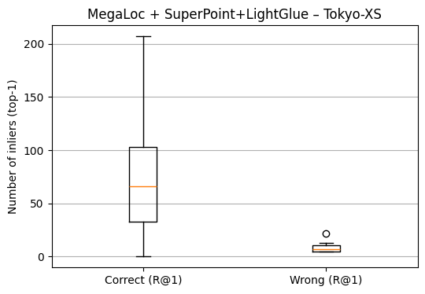
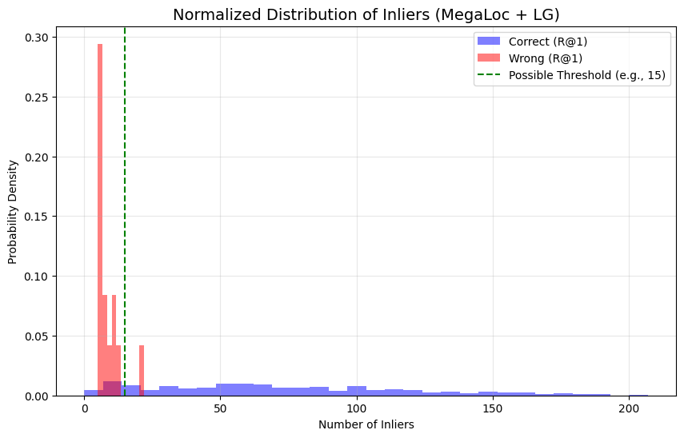

# Answers to Paragraph 5.2

## Difference between L2 and dot-product

Question: "Specifically, compare the L2 distance with the dot product as the distance measure and evaluate
how the metric choice influences the retrieval results. Do you see any changes? Why?"

As shown in `results.md`, we observe no significant difference in retrieval performance between L2 distance and Dot Product. This behavior is mathematically expected because all VPR descriptors (NetVLAD, CosPlace, MegaLoc) are L2-normalized during extraction.
For unit-length vectors, the Euclidean distance and the Dot Product (Cosine Similarity) are monotonically related. Therefore, the ranking of the retrieved candidates remains invariant regardless of the metric chosen. We selected L2 distance for the subsequent experiments since it was already given by the repo."

## Performance analysis with Image Matching

As shown in `results.md`, applying image matching on the top-20 retrieved candidates significantly boosts recall for weaker baselines. For NetVLAD on Tokyo-XS, R@1 improves from 54.0% to 68.9% (+14.9%), proving that the correct match is often present in the shortlist but ranked poorly by the global descriptor.

This accuracy gain comes at a high computational cost. The total inference time increases from ~6 minutes to over 50 minutes, depending on the number of queries. 
SuperGlue offers the best speed, while LightGlue and LoFTR provide slightly higher accuracy, at the cost of more than double the inference time in our configuration.
For real-time applications, the trade-off between the recall gain and the latency increase must be carefully evaluated.

## Correlation between queries’ correctness and the number of inliers with the first retrieved image

The figure below shows the distribution of the number of inliers obtained from the image matching stage for correct and incorrect top-1 retrievals on Tokyo-XS. Correct queries exhibit a significantly higher number of inliers, with a median of approximately 66, whereas incorrect queries show a very low number of inliers, with a median around 7. The limited overlap between the two distributions suggests a strong correlation between retrieval correctness and the number of geometric inliers, indicating that inlier count can be used as a reliable confidence measure to distinguish correct from incorrect predictions.

Correct queries:
- mean: 71.9
- median: 66.0
Wrong queries:
- mean: 8.6
- median: 7.0

Even the normalized density plot reveals a strong correlation between the number of inliers and the correctness of the retrieval. 
Incorrect predictions (red) are densely clustered in the low-inlier region (<20), while correct predictions (blue) exhibit a long-tail distribution extending to high inlier counts.

While the separation is evident, there is an overlap region between 5 and 25 inliers. In this range, a hard threshold (e.g., 15) might discard valid but difficult queries (false negatives). This observation justifies the use of a probabilistic model, such as Logistic Regression (Task 6.2), which can map the inlier count to a continuous probability score rather than a binary decision."

